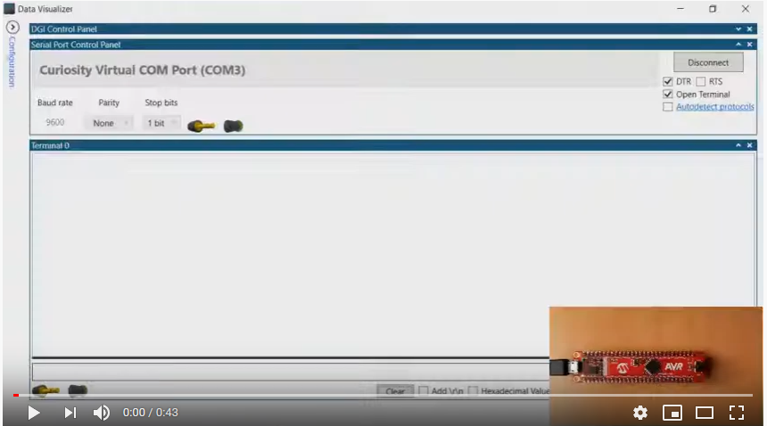
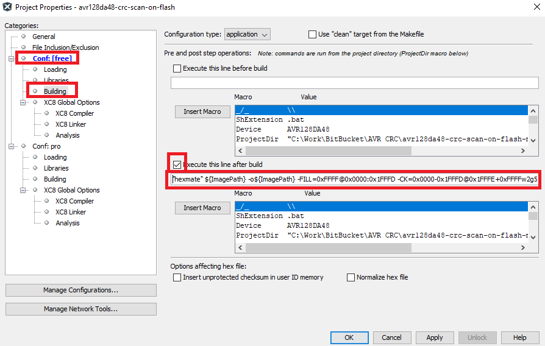

<!-- Please do not change this html logo with link -->

# CRC Scan on Flash memory - MPLAB X project

This example demonstrates usage of Cyclic Redundancy Check Memory Scan (CRCSCAN) peripheral to perform CRC operation on the Flash memory and Nonvolatile Memory Controller (NVMCTRL) peripheral to perform read and write operations on the Flash memory in runtime.

In this example, the CRCSCAN peripheral periodically performs CRC scan on Flash memory by calculating CRC checksum of the whole Flash and this is compared to a pre-calculated checksum. Hexmate tool which comes with MPLAB X IDE is used to pre-calculate CRC checksum and the calculated checksum is stored at a specific address in the Flash.

The result of CRC scan is displayed on a terminal window of data visualizer as well as indicated by on-board LED (LED0) of AVR128DA48 Curiosity Nano board. Upon switch (SW0) press event, one-byte of data in the Flash memory is modified using NVMCTRL peripheral. This results in CRC failure during the subsequent CRC scan.

**Note:** *This example is valid for all the AVR DA family MCUs*

**To see the CRC SCAN on Flash memory demo operation video, click on the below image.**

 

## Useful Links
- [AVR128DA48 Product Page](https://www.microchip.com/wwwproducts/en/AVR128DA28 "AVR128DA48 Product Page")
- [AVR128DA48 Code Examples on GitHub](https://github.com/microchip-pic-avr-examples?q=avr128da48 "AVR128DA48 Code Examples on GitHub")
- [AVR128DA48 Project Examples in START](https://start.atmel.com/#examples/AVR128DA48CuriosityNano "AVR128DA48 Project Examples in START")
- [CRC SCAN ON FLASH MEMORY - Studio Example](https://github.com/microchip-pic-avr-examples/avr128da48-crc-scan-on-flash-memory-studio "CRC SCAN ON FLASH MEMORY - Studio Example")
- [Hexmate](https://microchipdeveloper.com/xc8:hexmate-cli "Hexmate")

## Application Code Flow Diagram

 

## Software Used
- [MPLAB X IDE v5.45](https://www.microchip.com/mplab/mplab-x-ide "MPLAB X IDE v5.45")
- [XC8 Compiler v2.32](https://www.microchip.com/mplab/compilers "XC8 Compiler v2.32")
- [MPLAB Code Configurator (MCC) v4.1.0](https://www.microchip.com/mplab/mplab-code-configurator "MPLAB Code Configurator (MCC) v4.1.0")
- 8-bit AVR MCUs Library v2.7.0
- Code configurator Library v1.37.14
- AVR-Dx DFP v1.7.98
- [Standalone Data Visualizer v2.20.674](https://www.microchip.com/mplab/avr-support/data-visualizer "Standalone Data Visualizer v2.20.674")

**Note:** *For running the demo, the installed tool versions should be same or later.*

## Hardware used
[AVR128DA48 Curiosity Nano Evaluation Kit](https://www.microchip.com/DevelopmentTools/ProductDetails/PartNO/DM164151 "AVR128DA48 Curiosity Nano Evaluation Kit")
 

## Setup
Connect AVR128DA48 Curiosity Nano Board to Host Computer (PC) using standard Micro B USB cable.

## Operation
1. Open Standalone Data Visualizer. Select Virtual COM Port to which AVR DA nano board is connected. Click **Connect**.

    **Note:** *Alternately, open the MPLAB Data Visualizer plugin extension available to MPLAB X IDE.*
   

2. Open the crc16/crc32 project in MPLAB X IDE. (File -> Open Project)
3. Clean the project. (Right click on project name and click Clean)
4. Click **Make and Program Device**.
5. Once programming is completed, terminal window should start displaying the messages.
 

6. Scan starts after 8 sec. Result should be printed on terminal.
 

7. Press Switch (SW0) to change a byte at location “0x1FC01” in the Flash memory to 0x00.
 

8. Subsequent CRC scan will result in a failure and LED0 on Curiosity nano board turns ON.
 

9. Press switch again to change data back to 0xFF.
 

10. Subsequent scan will result in CRC success. LED turns OFF.
 

**IMPORTANT NOTE:** *Clean the project and then program the device by clicking* **Make and Program Device** 

## Changes for CRC32
This example firmware uses CRC16 by default. To use CRC32 make following changes to the project:
1. Uncomment `#define CRC32` *(main.c/->line 35)*
2. Change **SYSCFG0 fuse** *(MCC Generated Files/device_config.c/->line 46)* to
  `.SYSCFG0 = CRCSEL_CRC32_gc | CRCSRC_NOCRC_gc | RSTPINCFG_GPIO_gc,`
3. Change post build command *(project name -> Properties -> Conf -> Building -> Execute this line after build)* to
  `"C:\Program Files (x86)\Microchip\MPLABX\v5.45\mplab_platform\bin\hexmate"  ${ImagePath} -o${ImagePath}  -FILL=0xFFFF@0x0000:0x1FFFB -CK=0x0000-0x1FFFB@0x1FFFC+0xFFFFFFFFw-4g-5p0x04C11DB7`

**Note:** The system path for hexmate tool is dependent on the MPLAB version installed and the operating system used.

## Summary
This example demonstrates how CRCSCAN peripheral can be used to perform integrity check on Flash memory. It also demonstrates use of MNVCTRL peripheral to perform read and write operations on Flash memory in runtime.
The Below sections give brief explanation of Flash memory structure and CRC peripheral of AVR DA family for better understanding of the demo. Firmware generation section explains firmware generation using MCC and MPLAB X Linker options and Hexmate tools options used for this demo.

## Appendix:
## Flash Memory in AVR DA
The AVR128DA28/32/48/64 devices contain 128 KB on-chip in-system reprogrammable Flash memory for program storage. For write protection, the Flash program memory space can be divided into three sections: Boot Code section, Application Code section, and Application Data section.
Refer below table for details of Flash section write access.
 

**In this example, program is placed in APPCODE section and a byte from APPDATA section is being modified upon a switch press event.**

**Note:** *Refer* **add linker command** *subsection in* **Firmware Generation** *section to know about how to place program at a specific memory address*

#### Section Sizes

The sizes of these sections are set by the Boot Size (FUSE.BOOTSIZE) fuse and the Code Size (FUSE.CODESIZE) fuse. The fuses select the section sizes in blocks of 512 bytes. The BOOT section stretches from FLASHSTART to BOOTEND. The APPCODE section spreads from BOOTEND until APPEND. The remaining area is the APPDATA section.

**In this example, FUSE.BOOTSIZE is set to 2 and FUSE.CODESIZE is set to 254. Thus, first 2*512 bytes (1KB) is BOOT, the next 250*2 bytes (126 KB) is APPCODE and remaining 2*512 bytes (1KB) is APPDATA.**

## CRCSCAN in AVR DA

The CRC scan can be set up to scan the entire Flash, only the boot section, or both the boot and application code sections.  **In this example, it is set to scan entire Flash.**

The CRCSCAN can be configured to perform a code memory scan before the device leaves Reset. If this check fails, the CPU is not allowed to start normal code execution. This option is enabled for CRC16 firmware.

**Note:** *For CRC32, XOR operation needs to be performed on the generated checksum.  This option is not available with Hexmate. The Final XOR operation is performed by the MCU. So, this option cannot be enabled for CRC32.*    

&nbsp;

#### CRC Polynomials Options

The CRC generator supports CRC16-CCITT and CRC32 (IEEE 802.3).

The polynomial options are:
- CRC16-CCITT: x16 + x12 + x5 + 1
- CRC32: x32 + x26 + x23 + x22 + x16 + x12 + x11 + x10 + x8 + x7 + x5 + x4 + x2 + x + 1

**This example contains two firmware projects, one for CRC16 and other for CRC32.**    

&nbsp;

#### Location to store pre-calculated CRC

The pre-calculated checksum must be present in the last location of the section to be checked. **As this example checks CRC for entire Flash, CRC is placed in last location of Flash. (which is happened to be in APPDATA section)**

**Note:** *Refer* **add post build command** *subsection in* **Firmware Generation** *section to know how to pre-calculate CRC Flash memory and place in last location of Flash using Hexmate.*
 

## Adding Linker and Post Build Command

#### 1. Add Linker Command
- Open Project Properties by right clicking **project name -> Properties**
- Add a linker command to the project under **XC8 Global Options -> XC8 Linker -> Additional options**, as shown below
 

**Command:**
`-Wl,-Ttext=0x400`

This command keeps the application code at 0x400 location in the Flash memory. It is the start of APPCODE section of Flash as discussed in the previous section. For details of other linker commands refer MPLAB XC8 C Compiler User Guide for AVR MCU.

#### 2. Add Post Build Command
- Open Project Properties by right clicking **project name -> Properties**
- Add a post-build command to the project under **Conf -> Building**, as shown below
- Also check the **Execute this line after build** option as shown below
 

**Command:**
`"C:\Program Files (x86)\Microchip\MPLABX\v5.40\mplab_platform\bin\hexmate"  ${ImagePath} -o${ImagePath} -FILL=0xFFFF@0x0000:0x1FFFD -CK=0x0000-0x1FFFD@0x1FFFE+0xFFFFw2g5p0x1021`

Note : In this command, ensure on your PC the MPLAB IDE tool path specified is same or different "C:\Program Files (x86)\Microchip\MPLABX\v5.40\mplab_platform\bin\hexmate" which includes hexmate tool used to calculate CRC. If the path is different make the changes accordingly.

This post build command takes the generated HEX file by linker, fill the remaining space of Flash with 0xFFFF (-FILL=0xFFFF@0x0000:0x1FFFD), calculate CRC, and keep the CRC checksum at the last 2 bytes of Flash. (-CK=0x0000-0x1FFFD@0x1FFFE+0xFFFFw2g5p0x1021).

CRC16 example calculates a CRC (g5), using an initial value of 0xFFFF (+0xFFFF) and a polynomial value of 0x1021 (p0x1021) from the HEX file data at addresses 0 through to 0x1FFFD (0x0000-0x1FFFD), placing the big-endian, 2-byte-wide result (w2) at address 0x1FFFE (@0x1FFFE) in the final HEX file.

For other Hexmate options, see the Utilities Chapter in the MPLAB XC8 C Compiler User Guide.

**For CRC32 use following command**
`"C:\Program Files (x86)\Microchip\MPLABX\v5.40\mplab_platform\bin\hexmate"  ${ImagePath} -o${ImagePath}  -FILL=0xFFFF@0x0000:0x1FFFB -CK=0x0000-0x1FFFB@0x1FFFC+0xFFFFFFFFw-4g-5p0x04C11DB7`

**Note:** *For CRC32, XOR operation needs to be performed on the generated checksum. This option is not available with Hexmate. Thus, the final XOR operation is performed by the MCU.*
